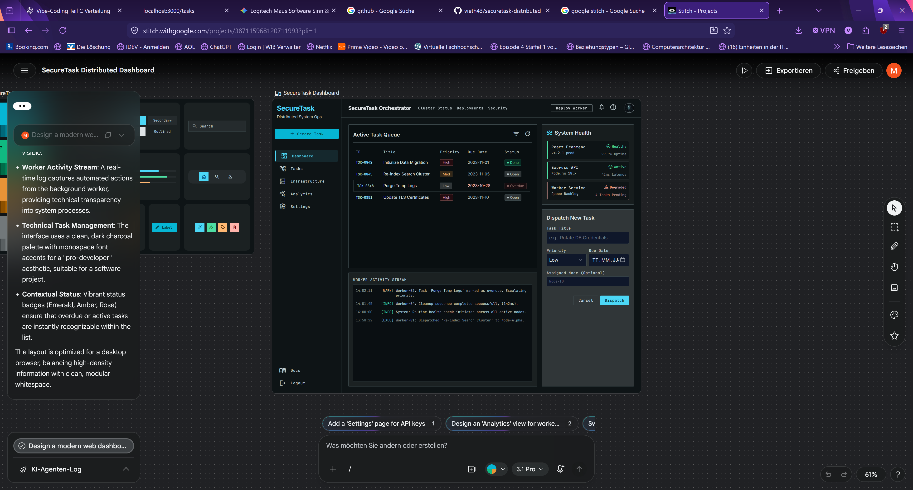
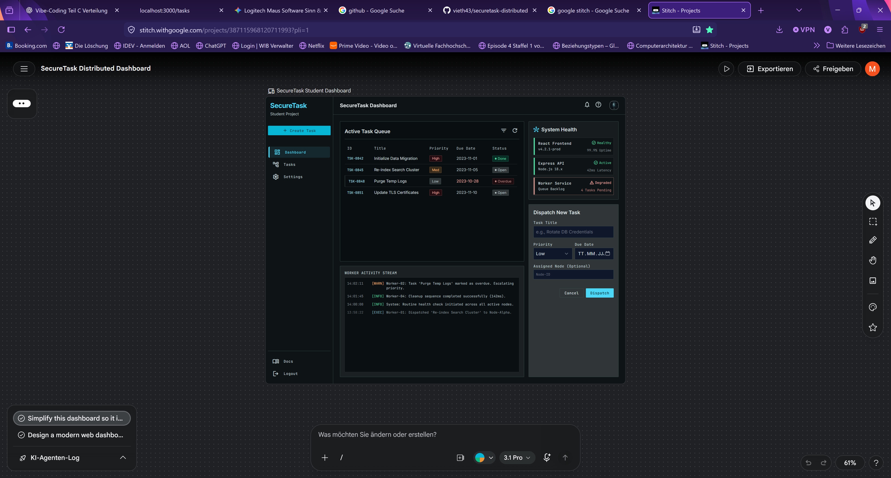
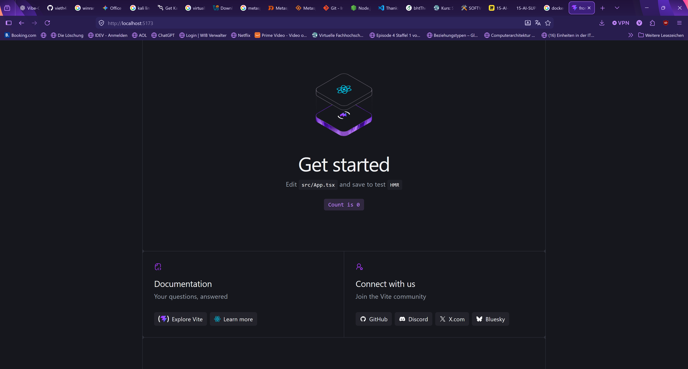
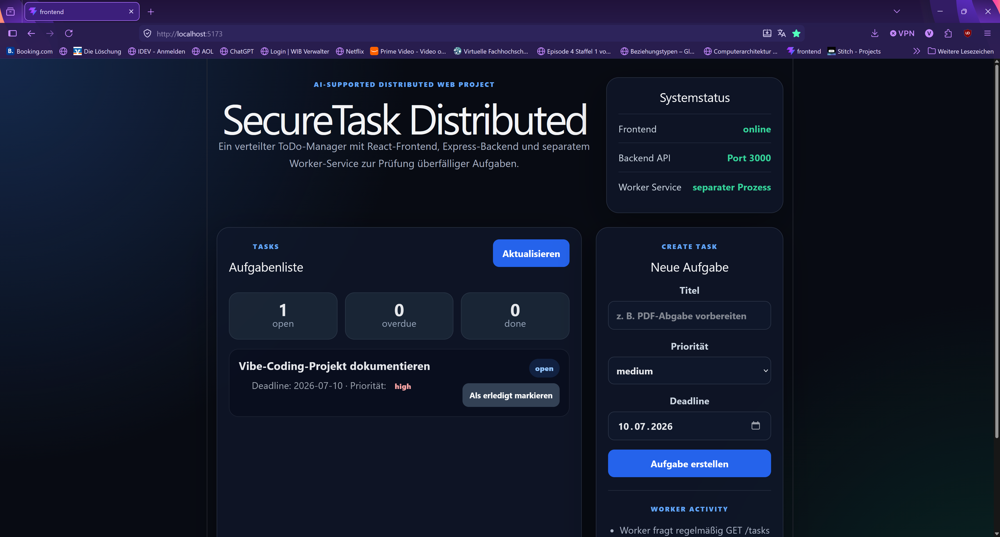
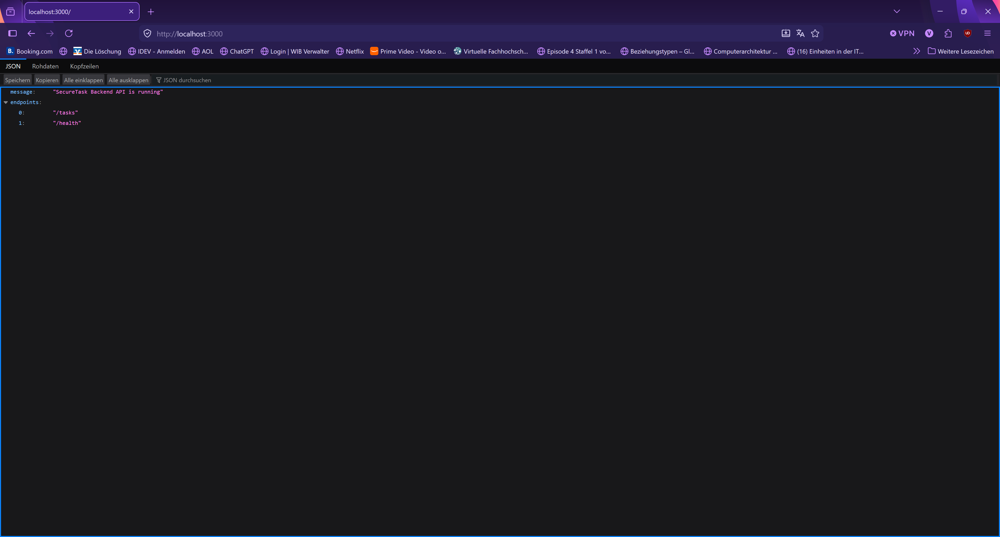
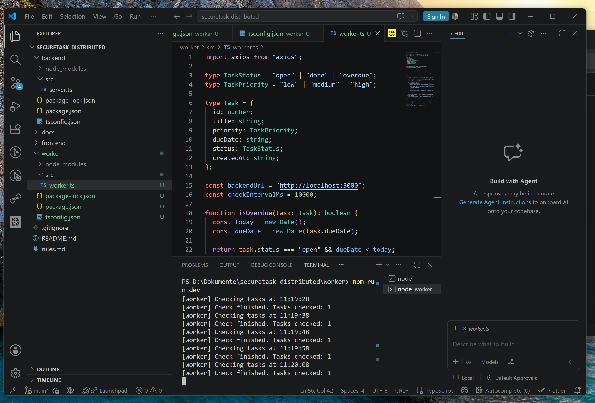
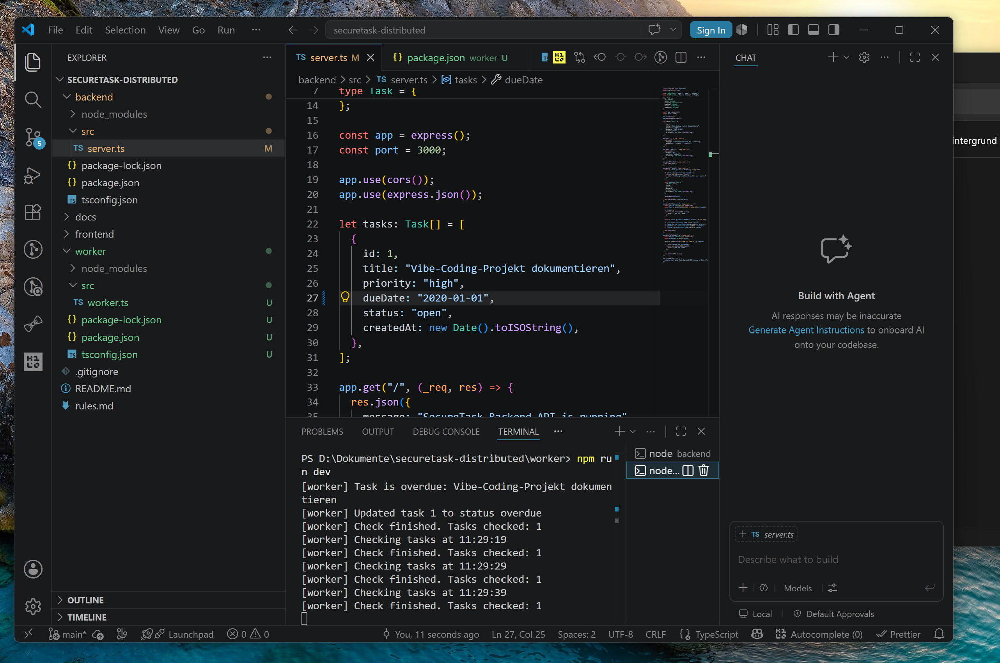
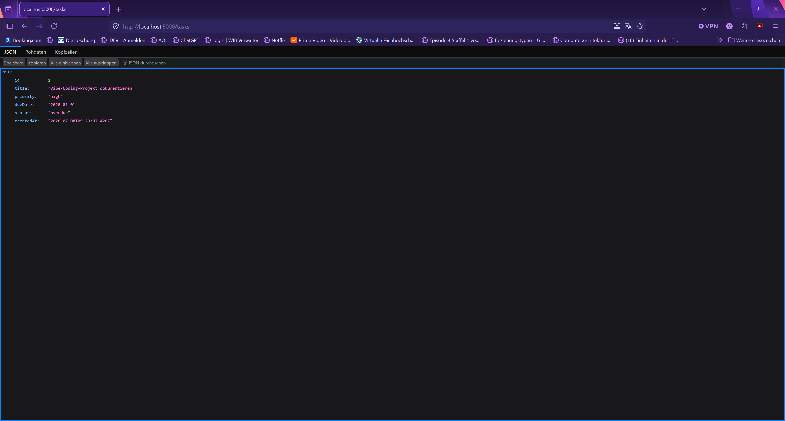

# SecureTask Distributed

SecureTask ist ein kleiner AI-unterstützt entwickelter ToDo-Manager.

Die Anwendung verwaltet Aufgaben mit Titel, Priorität, Deadline und Status. Zusätzlich gibt es einen separaten Worker-Prozess, der überfällige Aufgaben automatisch erkennt und den Status auf `overdue` setzt.

## Zuordnung zur Aufgabe

Ich habe die drei Aufgabenteile A, B und C als ein gemeinsames Projekt umgesetzt.

### A: GUI / Vibe Coding

Für den ersten Entwurf der Oberfläche wurde Google Stitch verwendet. Ziel war ein Dashboard für einen Aufgabenmanager mit Aufgabenliste, Statusanzeigen und Hinweisen auf die verteilten Komponenten.

Die verwendeten GUI-Prompts stehen in:

```text
docs/01_gui_prompts.md
```

### B: Pet Project

Aus dem GUI-Entwurf wurde eine kleine Web-App umgesetzt.

Die App besteht aus:

```text
frontend/   React + TypeScript
backend/    Node.js + Express + TypeScript
```

Das Frontend zeigt Aufgaben an, erstellt neue Aufgaben und kommuniziert über HTTP mit dem Backend. Das Backend stellt dafür eine einfache REST-API bereit.

### C: Distributed App

Für den verteilten Teil wurde ein separater Worker-Service ergänzt:

```text
worker/     eigener Node.js-Prozess
```

Der Worker läuft unabhängig vom Frontend und Backend. Er fragt regelmäßig die Backend-API ab, prüft offene Aufgaben und setzt überfällige Aufgaben per HTTP auf den Status `overdue`.

Dadurch besteht die Anwendung aus mehreren getrennten laufenden Prozessen:

```text
Frontend  ->  Backend API  <-  Worker
Browser       Express           eigener Node.js-Prozess
```

Das ist der zentrale verteilte Aspekt des Projekts.

## Screenshots

### A: GUI-Entwurf mit Google Stitch



Erster mit Google Stitch erzeugter Dashboard-Entwurf.



Vereinfachter Entwurf als Grundlage für die spätere Umsetzung.

### B: Web-App



React-Frontend beim ersten lokalen Start.



Umgesetztes SecureTask-Dashboard mit Aufgabenliste und Eingabeformular.



Express-Backend läuft auf Port 3000.


Der Endpunkt `/tasks` liefert Aufgaben als JSON zurück.

### C: Worker / Distributed



Der Worker läuft als separater Prozess.



Der Worker erkennt eine überfällige Aufgabe und aktualisiert sie über die Backend-API.



Das Backend zeigt danach den aktualisierten Status `overdue`.

## Starten der Anwendung

Es werden drei Terminals benötigt.

### Backend

```bash
cd backend
npm install
npm run dev
```

Backend:

```text
http://localhost:3000
```

### Worker

```bash
cd worker
npm install
npm run dev
```

### Frontend

```bash
cd frontend
npm install
npm run dev
```

Frontend:

```text
http://localhost:5173
```

## AI-Unterstützung

AI wurde verwendet für:

- GUI-Ideen mit Google Stitch
- Strukturierung von Frontend, Backend und Worker
- Unterstützung bei TypeScript- und Git-Problemen
- Formulierung einzelner Dokumentationsabschnitte

Die verwendeten AI-Prompts stehen in:

```text
docs/02_ai_prompts.md
```

## Hinweise

Die Daten werden in diesem Projekt bewusst einfach im Speicher des Backends gehalten. Eine Datenbank wurde nicht ergänzt, weil der Schwerpunkt auf AI-unterstützter Entwicklung, GUI-Entwurf und Verteiltheit liegt.

